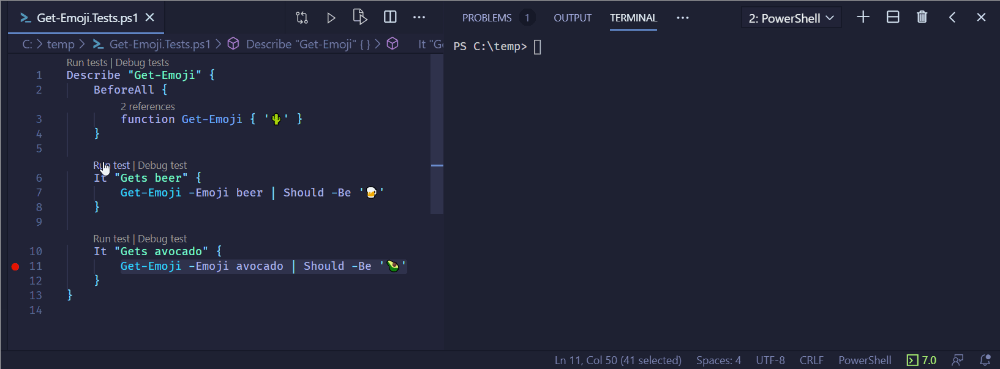

# Pester 5.0.0

> 💵 I am spending most of my weekends making this happen. These release notes for example took multiple days to write and update. Consider sponsoring [me](https://github.com/sponsors/nohwnd) or sponsoring [Pester](https://opencollective.com/pester), please.

> 🙋‍ Want to share feedback? [Go here](https://github.com/pester/Pester/issues/1218), or see more options in [Questions?](#questions).

- [Pester 5.0.0](#pester-500)
  - [What is new?](#what-is-new)
    - [Discovery & Run](#discovery--run)
      - [Put setup in BeforeAll](#put-setup-in-beforeall)
      - [Review your usage of Skip](#review-your-usage-of-skip)
      - [Review your usage of TestCases](#review-your-usage-of-testcases)
    - [Tags](#tags)
      - [Tags on everything](#tags-on-everything)
      - [Tags use wildcards](#tags-use-wildcards)
    - [Logging](#logging)
    - [Run only what is needed](#run-only-what-is-needed)
    - [Skip on everything](#skip-on-everything)
    - [Collect all Should failures](#collect-all-should-failures)
    - [Collecting `AfterEach` failures](#collecting-aftereach-failures)
    - [Normal, Detailed and Diagnostic view](#normal-detailed-and-diagnostic-view)
    - [New result object](#new-result-object)
    - [Simple and advanced interface](#simple-and-advanced-interface)
      - [Simple interface](#simple-interface)
      - [Advanced interface](#advanced-interface)
    - [Legacy interface](#legacy-interface)
    - [PesterPreference](#pesterpreference)
    - [Scoping of BeforeAll & AfterAll](#scoping-of-beforeall--afterall)
    - [Scoping of BeforeEach & AfterEach](#scoping-of-beforeeach--aftereach)
    - [Implicit parameters for TestCases](#implicit-parameters-for-testcases)
    - [Mocking](#mocking)
      - [Mocks are scoped based on their placement](#mocks-are-scoped-based-on-their-placement)
      - [Counting mocks depends on placement](#counting-mocks-depends-on-placement)
      - [Should -Invoke](#should--invoke)
      - [Default parameters for ParameterFilter](#default-parameters-for-parameterfilter)
      - [Mocks can be debugged](#mocks-can-be-debugged)
      - [Internal Mock functions are hidden](#internal-mock-functions-are-hidden)
      - [Avoid putting in InModuleScope around your Describe and It blocks](#avoid-putting-in-inmodulescope-around-your-describe-and-it-blocks)
    - [VSCode improvements](#vscode-improvements)
      - [Use legacy code lens](#use-legacy-code-lens)
      - [Output verbosity](#output-verbosity)
  - [Breaking changes](#breaking-changes)
    - [Actual breaking changes](#actual-breaking-changes)
    - [Deprecated features](#deprecated-features)
    - [Additional issues to be solved in 5.1](#additional-issues-to-be-solved-in-51)
- [Questions?](#questions)

## What is new?

> 🔥 Interested only in breaking changes? See [breaking changes](#breaking-changes) below.

> 🕹 want to see a demo? Here is my talk [What is new in Pester 5](https://www.youtube.com/watch?v=mTfUO00hWSc) from #BridgeConf


Pester 5.0.0 is finally here! 🥳 This version recommended to be used for new projects, and is the recommended choice if you just started learning Pester. If you own any project, please give it a try and report back to help me identify bugs.


### Discovery & Run

The fundamental change in this release is that Pester now runs in two phases: Discovery and Run. During discovery, it quickly scans your test files and discovers all the Describes, Contexts, Its and other Pester blocks.

This powers many of the features in this release and enables many others to be implemented [in the future](https://github.com/pester/Pester/issues?q=is%3Aopen+is%3Aissue+milestone%3A5.x).

To reap the benefits, there are new rules to follow:

**Put all your code into `It`, `BeforeAll`, `BeforeEach`, `AfterAll` or `AfterEach`. Put no code directly into `Describe`, `Context` or on the top of your file, without wrapping it in one of these blocks, unless you have a good reason to do so.**

**All misplaced code will run during Discovery, and its results won't be available during Run.**

This will allow Pester to control when all of your code is executed, and scope it correctly. This will also keep the amount of code executed during discovery to a minimum. Keeping it fast and responsive. See [discovery and script setup](https://jakubjares.com/2020/04/11/pester5-discovery-and-script-setup/) article for detailed information.

#### Put setup in BeforeAll
If your test suite already puts its setups and teardowns into `Before*` and `After*`. All you need to do is move the file setup into a `BeforeAll` block:

```powershell
BeforeAll {
    # DON'T use $MyInvocation.MyCommand.Path
    . $PSCommandPath.Replace('.Tests.ps1','.ps1')
}

Describe "Get-Cactus" {
    It "Returns 🌵" {
        Get-Cactus | Should -Be '🌵'
    }
}
```

See [migration script](https://gist.github.com/nohwnd/d488bd14ab4572f92ae77e208f476ada) for a script that does it for you. Improvements are welcome, e.g. putting code between `Describe` and `It` into `BeforeAll`. See [discovery and script setup](https://jakubjares.com/2020/04/11/pester5-discovery-and-script-setup/) and [importing ps files](https://jakubjares.com/2020/04/11/pester5-importing-ps-files/) article for detailed information.


#### Review your usage of Skip

This also impacts `-Skip` when you use it with `-Skip:$SomeCondition`. All the code in the describe block, including your skip conditions and TestCases will be evaluated during Discovery. Prefer static global variables, or code that is cheap to executed. It is not forbidden to put code to figure out the skip outside of `BeforeAll`, but be aware that it will run on every discovery.

This won't work. `BeforeAll` runs after Discovery, and so `$isSkipped` is not defined and ends up being `$null -> $false`, so the test will run.

```powershell
Describe "d" {
    BeforeAll {
        function Get-IsSkipped {
            Start-Sleep -Second 1
            $true
        }
        $isSkipped = Get-IsSkipped
    }

    It "i" -Skip:$isSkipped {

    }
}
```

Changing the code like this will skip the test correctly, but be aware that the code will run every time Discovery is performed on that file. Depending on how you run your tests this might be every time.

```powershell
function Get-IsSkipped {
    Start-Sleep -Second 1
    $true
}
$isSkipped = Get-IsSkipped

Describe "d" {
    It "i" -Skip:$isSkipped {

    }
}
```

Consider settings the check statically into a global read-only variable (much like `$IsWindows`), or caching the response for a while. Are you in this situation? Get in touch via the channels mentioned in [Questions?](#questions).

#### Review your usage of TestCases

`-TestCases`, much like `-Skip` are evaluated during discovery and saved for later use when the test runs. This means that doing expensive setup for them will be happening every Discovery. On the other hand, you will now find their complete content for each TestCase in `Data` on the result test object. And also don't need to specify [param block](#implicit-parameters-for-testcases).

### Tags

#### Tags on everything

The tag parameter is now available on `Describe`, `Context` and `It` and it is possible to filter tags on any level. You can then use `-Tag` and `-ExcludeTag` to run just the tests that you want.

Here you can see an example of a test suite that has acceptance tests and unit tests, and some of the tests are slow, some are flaky, and some only work on Linux. Pester5 makes running all reliable acceptance tests, that can run on Windows is as simple as:


```powershell
Invoke-Pester $path -Tag "Acceptance" -ExcludeTag "Flaky", "Slow", "LinuxOnly"
```

```powershell
Describe "Get-Beer" {

    Context "acceptance tests" -Tag "Acceptance" {

        It "acceptance test 1" -Tag "Slow", "Flaky" {
            1 | Should -Be 1
        }

        It "acceptance test 2" {
            1 | Should -Be 1
        }

        It "acceptance test 3" -Tag "WindowsOnly" {
            1 | Should -Be 1
        }

        It "acceptance test 4" -Tag "Slow" {
            1 | Should -Be 1
        }

        It "acceptance test 5" -Tag "LinuxOnly" {
            1 | Should -Be 1
        }
    }

    Context "unit tests" {

        It "unit test 1" {
            1 | Should -Be 1
        }

        It "unit test 2" -Tag "LinuxOnly" {
            1 | Should -Be 1
        }

    }
}
```

```
Starting test discovery in 1 files.
Discovering tests in ...\real-life-tagging-scenarios.tests.ps1.
Found 7 tests. 482ms
Test discovery finished. 800ms

Running tests from '...\real-life-tagging-scenarios.tests.ps1'
Describing Get-Beer
  Context acceptance tests
      [+] acceptance test 2 50ms (29ms|20ms)
      [+] acceptance test 3 42ms (19ms|23ms)
Tests completed in 1.09s
Tests Passed: 2, Failed: 0, Skipped: 0, Total: 7, NotRun: 5
```

#### Tags use wildcards

The tags are now also compared as `-like` wildcards, so you don't have to spell out the whole tag if you can't remember it. This is especially useful when you are running tests locally:

```powershell
Invoke-Pester $path -ExcludeT "Accept*", "*nuxonly" | Out-Null
```
```
Starting test discovery in 1 files.
Discovering tests in ...\real-life-tagging-scenarios.tests.ps1.
Found 7 tests. 59ms
Test discovery finished. 97ms


Running tests from '...\real-life-tagging-scenarios.tests.ps1'
Describing Get-Beer
 Context Unit tests
   [+] unit test 1 15ms (7ms|8ms)
Tests completed in 269ms
Tests Passed: 1, Failed: 0, Skipped: 0, Total: 7, NotRun: 6
```

### Logging

All the major components log extensively.I am using logs as a debugging tool all the time so I make sure the logs are usable and not overly verbose. See if you can figure out why `acceptance test 1` is excluded from the run, and why `acceptance test 2` runs.

```
Filter: (Get-Beer) There is 'Flaky, Slow, LinuxOnly' exclude tag filter.
Filter: (Get-Beer) Block did not match the exclude tag filter, moving on to the next filter.
Filter: (Get-Beer) There is 'Acceptance' include tag filter.
Filter: (Get-Beer) Block has no tags, moving to next include filter.
Filter: (Get-Beer) Block did not match any of the include filters, but it will still be included in the run, it's children will determine if it will run.
Filter: (Get-Beer.acceptance tests) There is 'Flaky, Slow, LinuxOnly' exclude tag filter.
Filter: (Get-Beer.acceptance tests) Block did not match the exclude tag filter, moving on to the next filter.
Filter: (Get-Beer.acceptance tests) There is 'Acceptance' include tag filter.
Filter: (Get-Beer.acceptance tests) Block is included, because it's tag 'Acceptance' matches tag filter 'Acceptance'.
Filter: (Get-Beer.acceptance tests.acceptance test 1) There is 'Flaky, Slow, LinuxOnly' exclude tag filter.
Filter: (Get-Beer.acceptance tests.acceptance test 1) Test is excluded, because it's tag 'Flaky' matches exclude tag filter 'Flaky'.
Filter: (Get-Beer.acceptance tests.acceptance test 2) There is 'Flaky, Slow, LinuxOnly' exclude tag filter.
Filter: (Get-Beer.acceptance tests.acceptance test 2) Test did not match the exclude tag filter, moving on to the next filter.
Filter: (Get-Beer.acceptance tests.acceptance test 2) Test is included, because its parent is included.
Filter: (Get-Beer.acceptance tests.acceptance test 3) There is 'Flaky, Slow, LinuxOnly' exclude tag filter.
Filter: (Get-Beer.acceptance tests.acceptance test 3) Test did not match the exclude tag filter, moving on to the next filter.
Filter: (Get-Beer.acceptance tests.acceptance test 3) Test is included, because its parent is included.
Filter: (Get-Beer.acceptance tests.acceptance test 4) There is 'Flaky, Slow, LinuxOnly' exclude tag filter.
Filter: (Get-Beer.acceptance tests.acceptance test 4) Test is excluded, because it's tag 'Slow' matches exclude tag filter 'Slow'.
Filter: (Get-Beer.acceptance tests.acceptance test 5) There is 'Flaky, Slow, LinuxOnly' exclude tag filter.
Filter: (Get-Beer.acceptance tests.acceptance test 5) Test is excluded, because it's tag 'LinuxOnly' matches exclude tag filter 'LinuxOnly'.
Filter: (Get-Beer.Unit tests) There is 'Flaky, Slow, LinuxOnly' exclude tag filter.
Filter: (Get-Beer.Unit tests) Block did not match the exclude tag filter, moving on to the next filter.
Filter: (Get-Beer.Unit tests) There is 'Acceptance' include tag filter.
Filter: (Get-Beer.Unit tests) Block has no tags, moving to next include filter.
Filter: (Get-Beer.Unit tests) Block did not match any of the include filters, but it will still be included in the run, it's children will determine if it will run.
Filter: (Get-Beer.Unit tests.unit test 1) There is 'Flaky, Slow, LinuxOnly' exclude tag filter.
Filter: (Get-Beer.Unit tests.unit test 1) Test did not match the exclude tag filter, moving on to the next filter.
Filter: (Get-Beer.Unit tests.unit test 1) There is 'Acceptance' include tag filter.
Filter: (Get-Beer.Unit tests.unit test 1) Test has no tags, moving to next include filter.
Filter: (Get-Beer.Unit tests.unit test 1) Test did not match any of the include filters, it will not be included in the run.
Filter: (Get-Beer.Unit tests.unit test 2) There is 'Flaky, Slow, LinuxOnly' exclude tag filter.
Filter: (Get-Beer.Unit tests.unit test 2) Test is excluded, because it's tag 'LinuxOnly' matches exclude tag filter 'LinuxOnly'.
Filter: (Get-Beer.Unit tests) Block was marked as Should run based on filters, but none of its tests or tests in children blocks were marked as should run. So the block won't run.
```

Please be aware that the log is currently only written to the screen and not persisted in the result object. And that the logging comes with a performance penalty. You can enable logging by using the configuration object, or by using `-Output Diagnostic`.

### Run only what is needed

Look at the last line of the above log. It says that the block will not run, because none of the tests inside of it, or inside of any of the children blocks will run. This is great because when the block does not run, none of its setups and teardowns run either.

Invoking the code below with `-ExcludeTag Acceptance` will filter out all the tests in the file and there will be nothing to run. Pester5 understands that if there are no tests in the file to run, there is no point in executing the setups and teardowns in it, and so it returns almost immediately:


```powershell
BeforeAll {
    Start-Sleep -Seconds 3
}

Describe "describe 1" {
    BeforeAll {
        Start-Sleep -Seconds 3
    }

    It "acceptance test 1" -Tag "Acceptance" {
        1 | Should -Be 1
    }

    AfterAll {
        Start-Sleep -Seconds 3
    }
}
```

```
Starting test discovery in 1 files.
Found 1 tests. 64ms
Test discovery finished. 158ms
Tests completed in 139ms
Tests Passed: 0, Failed: 0, Skipped: 0, Total: 1, NotRun: 1
```

### Skip on everything

`-Skip` is now available on Describe and Context. This allows you to skip all the tests in that block and every child block.


```powershell
Describe "describe1" {
    Context "with one skipped test" {
        It "test 1" -Skip {
            1 | Should -Be 2
        }

        It "test 2" {
            1 | Should -Be 1
        }
    }

    Describe "that is skipped" -Skip {
        It "test 3" {
            1 | Should -Be 2
        }
    }

    Context "that is skipped and has skipped test" -Skip {
        It "test 3" -Skip {
            1 | Should -Be 2
        }

        It "test 3" {
            1 | Should -Be 2
        }
    }
}
```

```
Starting test discovery in 1 files.
Found 5 tests. 117ms
Test discovery finished. 418ms
Describing describe1
 Context with one skipped test
   [!] test 1, is skipped 18ms (0ms|18ms)
   [+] test 2 52ms (29ms|22ms)
 Describing that is skipped
   [!] test 3, is skipped 12ms (0ms|12ms)
 Context that is skipped and has skipped test
   [!] test 3, is skipped 10ms (0ms|10ms)
   [!] test 3, is skipped 10ms (0ms|10ms)
Tests completed in 1.03s
Tests Passed: 1, Failed: 0, Skipped: 4, Total: 5, NotRun: 0
```

(Pending is translated to skipped, Inconclusive does not exist anymore. Are you relying on them extensively? Share your [feedback](https://github.com/pester/Pester/issues/1218).)

### Collect all Should failures

`Should` can now be configured to continue on failure. This will report the error to Pester, but won't fail the test immediately. Instead, all the Should failures are collected and reported at the end of the test. This allows you to put multiple assertions into one It and still get complete information on failure.

```powershell
function Get-User {
    @{
        Name = "Jakub"
        Age = 31
    }
}

Describe "describe" {
    It "user" {
        $user = Get-User

        $user | Should -Not -BeNullOrEmpty -ErrorAction Stop
        $user.Name | Should -Be "Tomas"
        $user.Age | Should -Be 27

    }
}

```

```
Starting test discovery in 1 files.
Found 1 tests. 51ms
Test discovery finished. 83ms
Describing describe
  [-] user 124ms (109ms|15ms)
   [0] Expected strings to be the same, but they were different.
   String lengths are both 5.
   Strings differ at index 0.
   Expected: 'Tomas'
   But was:  'Jakub'
   at $user.Name | Should -Be "Tomas"
   [1] Expected 27, but got 31.
   at $user.Age | Should -Be 27
Tests completed in 286ms
Tests Passed: 0, Failed: 1, Skipped: 0, Total: 1, NotRun: 0
```

This allows you to check complex objects easily without writing It for each of the properties that you want to test. You can also use `-ErrotAction Stop` to force a failure when a pre-condition is not met. In our case if `$user` was null, there would be no point in testing the object further and we would fail the test immediately.

This new Should behavior is opt-in and can be enabled via `Should.ErrorAction = 'Continue'` on the configuration object or via `$PesterPreference` more on that below.

### Collecting `AfterEach` failures

In a similar fashion to Should, when test assertion fails, and it teardown also fails you will see both errors:

```
[-] fails the test 30ms (24ms|5ms)
 [0] Expected 2, but got 1.
 at 1 | Should -Be 2
 [1] RuntimeException: but also fails in after each
```

### Normal, Detailed and Diagnostic view

Errors are usually what we are interested in when running tests. And that is why Pester5 implements a concise view that prints failed tests with the full test path, and minimal discovery and summary information:

```
Starting test discovery in 1 files.
Test discovery finished. 83ms
[-] output.fails 24ms (18ms|5ms)
 Expected 2, but got 1.
 at 1 | Should -Be 2, C:\Projects\pester\Pester.RSpec.Demo.ts.ps1:289
 at <ScriptBlock>, C:\Projects\pester\Pester.RSpec.Demo.ts.ps1:289
[-] output.child.fails 22ms (16ms|5ms)
 Expected 2, but got 1.
 at 1 | Should -Be 2, C:\Projects\pester\Pester.RSpec.Demo.ts.ps1:298
 at <ScriptBlock>, C:\Projects\pester\Pester.RSpec.Demo.ts.ps1:298
Tests completed in 331ms
Tests Passed: 4, Failed: 2, Skipped: 0, Total: 6, NotRun: 0
```

Pester5 also implements a Diagnostic view that prints information from Discovery, Filter, Skip, Mock and other sources, this output will be by default enabled when debugging tests in VSCode, or you can enable it by using `-Output Diagnostic`.

```shell
Mock: Found 2 behaviors for 'Get-Emoji':
    Body: { '🚒' }
    Filter: { $Emoji -eq 'firetruck' }
    Verifiable: False
    Body: { '🔥' }
    Filter: $null
    Verifiable: False
Mock: We are in a test. Returning mock table from test scope.
Mock: Finding a mock behavior.
Mock: Running mock filter {  $Emoji -eq 'firetruck'  } with context: Emoji = firetruck.
Mock: Mock filter passed.
Mock: {  '🚒'  } passed parameter filter and will be used for the mock call.
Mock: Executing mock behavior for mock Get-Emoji.
Mock: Behavior for Get-Emoji was executed.
Mock: Removing function PesterMock_3b8fd8ae-de6a-4a1c-87a8-7b177071f4af and aliases Get-Emoji for Get-Emoji.
  [+] Gets firetruck 2.78s (2.71s|64ms)
Tests completed in 4.71s
Tests Passed: 1, Failed: 0, Skipped: 0 NotRun: 0
```

### New result object

The new result object is extremely rich, and used by Pester internally to make all of its decisions. Most of the information in the tree is unprocessed to allow you to to work with the raw data. You are welcome to inspect the object, and write your code based on it.

To use your current CI pipeline with the new object use `ConvertTo-Pester4Result` to convert it. To convert the new object to NUnit report use `ConvertTo-NUnitReport` or specify the `-CI` switch to enable NUnit output, code coverage and exit code on failure.

### Simple and advanced interface

`Invoke-Pester` is extremely bloated in Pester4. Some of the parameters consume hashtables that I always have to google, and some of the names don't make sense anymore. In Pester5 I aimed to simplify this interface and get rid of the hashtables. Right now I landed on two vastly different apis. With a big hole in the middle that still remains to be defined. There is the Simple interface that looks like this:

```
Invoke-Pester -Path <String[]>
              -ExcludePath <String[]>
              -Tag <String[]>
              -ExcludeTag <String[]>
              -Output <String>
              -CI
```

And the Advanced interface that takes just Pester configuration object and nothing else:

```
Invoke-Pester -Configuration <PesterConfiguration>
```

A mapping of the parameters of the simple interface to the configuration object properties on the advanced interface is:

| Parameter   | Configuration Object Property                                              |
| ----------- | -------------------------------------------------------------------------- |
| Path        | Run.Path                                                                   |
| ExcludePath | Run.ExcludePath                                                            |
| Tag         | Filter.Tag                                                                 |
| ExcludeTag  | Filter.ExcludeTag                                                          |
| Output      | Output.Verbosity                                                           |
| CI          | CodeCoverage.Enabled, TestResult.Enabled and Run.Exit (all set to `$true`) |
| PassThru    | Run.PassThru                                                               |

#### Simple interface

The simple interface is what I mostly need to run my tests. It uses some sensible defaults, and most of the parameters are hopefully self explanatory. The CI switch enables NUnit output to `testResults.xml`, code coverage that is automatically figured out from the provided files and exported into coverage.xml and also enables exit with error code when anything fails.

#### Advanced interface

Advanced interface uses `PesterConfiguration` object which contains all options that you can provide to Pester and contains descriptions for all the configuration sections and as well as default values. Here is what you see when you look at the default Debug section of the object:

```powershell
[PesterConfiguration]::Default.Debug | Format-List

ShowFullErrors         : Show full errors including Pester internal stack. (False, default: False)
WriteDebugMessages     : Write Debug messages to screen. (False, default: False)
WriteDebugMessagesFrom : Write Debug messages from a given source, WriteDebugMessages must be set to true for this to work. You can use like wildcards to get messages from multiple sources, as well as * to get everything. (*, default: *)
ShowNavigationMarkers  : Write paths after every block and test, for easy navigation in VSCode. (False, default: False)
WriteVSCodeMarker      : Write VSCode marker for better integration with VSCode. (False, default: False)
```

The configuration object can be constructed either via the Default static property or by casting a hashtable to it. You can also cast a hashtable to any of its sections. Here are three different ways to the same goal:

```powershell
# get default from static property
$configuration = [PesterConfiguration]::Default
# assing properties & discover via intellisense
$configuration.Run.Path = 'C:\projects\tst'
$configuration.Filter.Tag = 'Acceptance'
$configuration.Filter.ExcludeTag = 'WindowsOnly'
$configuration.Should.ErrorAction = 'Continue'
$configuration.CodeCoverage.Enabled = $true

# cast whole hashtable to configuration
$configuration = [PesterConfiguration]@{
    Run = @{
        Path = 'C:\projects\tst'
    }
    Filter = @{
        Tag = 'Acceptance'
        ExcludeTag = 'WindowsOnly'
    }
    Should = @{
        ErrorAction = 'Continue'
    }
    CodeCoverage = @{
        Enable = $true
    }
}

# cast from empty hashtable to get default
$configuration = [PesterConfiguration]@{}
$configuration.Run.Path = 'C:\projects\tst'
# cast hashtable to section
$configuration.Filter = @{
        Tag = 'Acceptance'
        ExcludeTag = 'WindowsOnly'
    }
$configuration.Should.ErrorAction = 'Continue'
$configuration.CodeCoverage.Enabled = $true

```

This configuration object contains all the options that are currently supported and the Simple interface is internally translates to this object internally. It is the source of truth for the defaults and configuration. The Intermediate api will be figured out later, as well as all the other details.

### Legacy interface

The following table shows a mapping of v4 Legacy parameters (those which have not been documented under the Simple/Advanced interfaces) to the configuration object

| Parameter                       | Configuration Object Property                          |
| ------------------------------- | ------------------------------------------------------ |
| FullNameFilter                  | Filter.FullName                                        |
| EnableExit                      | Run.Exit                                               |
| CodeCoverage                    | CodeCoverage.Path                                      |
| CodeCoverageOutputFile          | CodeCoverage.CodeCoverageOutputFile                    |
| CodeCoverageOutputFileEncoding  | CodeCoverage.CodeCoverageOutputFileEncoding            |
| CodeCoverageOutputFileFormat    | CodeCoverage.CodeCoverageOutputFileFormat              |
| OutputFile                      | TestResult.OutputFile                                  |
| OutputFormat                    | TestResult.OutputFormat                                |
| Show                            | Output.Verbosity (via mapping; see below)              |

The following table shows the mapping for v4 *Show* property values to the configuration property *Output.Verbosity*:

| *Show* value                    | Configuration Object *Output Verbosity* Property       |
| ------------------------------- | ------------------------------------------------------ |
| All                             | Detailed                                               |
| Default                         | Detailed                                               |
| Detailed                        | Detailed                                               |
| Fails                           | Normal                                                 |
| Diagnostic                      | Diagnostic                                             |
| Normal                          | Normal                                                 |
| Minimal                         | Minimal                                                |
| None                            | None                                                   |

### PesterPreference

There is one more way to provide the configuration object which is `$PesterPreference`. On `Invoke-Pester` (in case of interactive execution `Invoke-Pester` is called inside of the first `Describe`) the preference is collected and merged with the configuration object if provided. This allows you to configure everything that you would via Invoke-Pester also when you are running interactively (via `F5`). You can also use this to define the defaults for your session by putting $PesterPreference into your PowerShell profile.

Here is a simple example of enabling Mock logging output while running interactively :

```powershell
$PesterPreference = [PesterConfiguration]::Default
$PesterPreference.Debug.WriteDebugMessages = $true
$PesterPreference.Debug.WriteDebugMessagesFrom = "Mock"

BeforeAll {
    function a { "hello" }
}
Describe "pester preference" {
    It "mocks" {
        Mock a { "mock" }
        a | Should -Be "mock"
    }
}
```

```
Starting test discovery in 1 files.
Discovering tests in C:\Users\jajares\Desktop\mck.tests.ps1.
Found 1 tests. 44ms
Test discovery finished. 80ms


Running tests from 'C:\Users\jajares\Desktop\mck.tests.ps1'
Describing pester preference
Mock: Setting up mock for a.
Mock: We are in a test. Returning mock table from test scope.
Mock: Resolving command a.
Mock: Searching for command  in the caller scope.
Mock: Found the command a in the caller scope.
Mock: Mock does not have a hook yet, creating a new one.
Mock: Defined new hook with bootstrap function PesterMock_b0bde5ee-1b4f-4b8f-b1dd-aef38b3bc13d and aliases a.
Mock: Adding a new default behavior to a.
Mock: Mock bootstrap function a called from block Begin.
Mock: Capturing arguments of the mocked command.
Mock: Mock for a was invoked from block Begin.
Mock: Getting all defined mock behaviors in this and parent scopes for command a.
Mock: We are in a test. Finding all behaviors in this test.
Mock: Found behaviors for 'a' in the test.
Mock: Finding all behaviors in this block and parents.
... shortened Mock does a lot of stuff
Verifiable: False
Mock: We are in a test. Returning mock table from test scope.
Mock: Removing function PesterMock_b0bde5ee-1b4f-4b8f-b1dd-aef38b3bc13d and aliases a for .
  [+] mocks 857ms (840ms|16ms)
Tests completed in 1.12s
Tests Passed: 1, Failed: 0, Skipped: 0, Total: 1, NotRun: 0
```

### Scoping of BeforeAll & AfterAll

`BeforeAll` can now be placed above the the top-level `Describe`, and you should move your setup into it. `AfterAll` is not allowed in the top level block.

The scoping is very similar to Pester v4, but without the quirks. `BeforeAll`, `Describe`, and `AfterAll` now run all in the same scope, and are isolated from their parent scope, to avoid leaking variables outside of their scopes, for example into the script scope. This prevents test cross-pollution and makes your tests more repeatable.

Failures in setup and teardown work very similar to how they worked in Pester v4, a failure in a `Describe` block, `BeforeAll` or `AfterAll` will fail the whole block. The nice side-effect of having test discovery is that we now know how many tests were in that failed block and can report all tests that were supposed to run as failed.

### Scoping of BeforeEach & AfterEach

`BeforeEach`, `It` and `AfterEach` now run in the same scope, but are still isolated from their parent to avoid leaking variables and test cross-pollution.

Running in single scope allows you to take a portion of your `It` and move it into `BeforeEach` without any change in behavior. And it also allows you to change a variable in `It`, and use the updated value in `AfterAll`.

### Implicit parameters for TestCases

Test cases are super useful, but I find it a bit annoying, and error prone to define the `param` block all the time, so when invoking `It` I am defining the variables in parent scope, and also splatting them. As a result you don't have to define the `param` block:

```powershell
Describe "a" {
    It "b" -TestCases @(
        @{ Name = "Jakub"; Age = 30 }
    ) {
        $Name | Should -Be "Jakub"
    }
}
```

This also works for [mock](#default-parameters-for-parameterfilter)

### Mocking

#### Mocks are scoped based on their placement

Mocks are no longer effective in the whole `Describe` / `Context` in which they were placed. Instead they will defualt to the block in which they were placed. Both of these work:

```powershell
Describe "d" {
    BeforeAll {
        function f () { "real" }
    }

    It "i" {
        Mock f { "mock" }
        f | Should -Be "mock"
    }

    It "j" {
        f | Should -Be "real"
    }
}

Describe "d" {
    BeforeAll {
        function f () { "real" }
        Mock f { "mock" }
    }

    It "i" {
        f | Should -Be "mock"
    }

    It "j" {
        f | Should -Be "mock"
    }
}
```

#### Counting mocks depends on placement

Counting mocks depends on where the assertion is placed. In `It`, `BeforeEach` and `AfterEach` it defaults to `It` scope. In `Describe`, `Context`, `BeforeAll` and `AfterAll`, it default to `Describe` or `Context` based on the command that contains them. The default can still be overriden by specifying `-Scope` parameter.

```powershell

Describe "d" {

    BeforeAll {
        function f () { "real" }
        Mock f { "mock" }
    }

    It "i" {
        f
        Should -Invoke f -Exactly 1
    }

    It "j" {
        f
        Should -Invoke f -Exactly 1
    }

    It "k" {
        f
        Should -Invoke f -Exactly 3 -Scope Describe
    }

    AfterEach {
        Should -Invoke f -Exactly 1
    }

    AfterAll {
        Should -Invoke f -Exactly 3
    }
}
```

#### Should -Invoke

Mock counting assertions were renamed to `Should -Invoke` and `Should -InvokeVerifiable`, and most of their parameters are no longer positional. `Assert-MockCalled` and `Assert-VerifiableMock` are provided as functions, and are deprecated.

#### Default parameters for ParameterFilter

Parameter filters no longer require you to use `param()`.

```powershell
Describe "d" {

    BeforeAll {
        function f ($a) { "real" }
        Mock f { "mock" } -ParameterFilter { $a -eq 10 }
    }

    It "i" {
        f 10
        Should -Invoke f -Exactly 1
    }

    It "j" {
        f 20
        Should -Invoke f -Exactly 0
    }
}
```

#### Mocks can be debugged

Mocks don't rewrite the scriptblock you provide anymore. You can now set breakpoints into them as well as any of the ParameterFilter or Should -Invoke Parameter filter.

#### Internal Mock functions are hidden

v4 published few internal functions that were needed to successfully call back into Pester from the mock bootstrap function. In v5 I came up with a little trick that enabled me to remove all the internal functions from the public API.

When Pester generates the mock bootstrap function it produces a command info object (the thing you get from `Get-Command <some command>`). I take that object and attach a new property on it that contains data from Pester. When the bootstrap function executes, it can simply use `$MyInvocation.MyCommand` to reach the _same_ command info object, and so it can reach the data Pester gave it. Among this data is a command info of internal Pester function `Invoke-Mock` which is then simply invoked by `&`.

#### Avoid putting in InModuleScope around your Describe and It blocks

`InModuleScope` is a simple way to expose your internal module functions to be tested, but it prevents you from properly testing your published functions, does not ensure that your functions are actually published, and slows down Discovery by loading the module. Aim to avoid it altogether by using `-ModuleName` on `Mock`. Or at least avoid placing `InModuleScope` outside of `It`.

### VSCode improvements

#### Use legacy code lens

With Pester 5 it is finally possible to run and debug just a single test in VSCode!



In the latest [PowerShell Preview](https://marketplace.visualstudio.com/items?itemName=ms-vscode.PowerShell-Preview) extension for VSCode you can enable Use Legacy Code Lens option which will enable `Run tests` on all `Describe`, `Context` and `It` blocks. You can run a whole block, any child block, or any test individually. You can also run tests that are marked as skipped by running them individually.

Actually there is a bug, and the option is called Enable Legacy Code Lens, and is enabled by default and can't be disabled. 😁 Take advantage of this and go try it right now!

#### Output verbosity

You can specify verbosity in VSCode, to see normal or detailed output, or to take it from PesterPreference. This also works for Pester 4!


## Breaking changes

### Actual breaking changes

- (❗ new in 5.0.1)  The Parameters of `Invoke-Pester` changed significantly, but in 5.0.1, a compatibility parameter set was added. To allow all the v4 parameters to be used, e.g. like this `Invoke-Pester -Script $testFile -PassThru -Verbose -OutputFile $tr -OutputFormat NUnitXml -CodeCoverage "$tmp/*-*.ps1" -CodeCoverageOutputFile $cc -Show All`. The compatibility is not 100%, neither -Script not -CodeCoverage take hashtables, they just take a collection of paths. The `-Strict` parameter and `-PesterOption` are ignored. The `-Output` \ `-Show` parameter takes all the values, but translates only the most used options to Pester 5 compatible options, otherwise it uses `Detailed` output. It also allows all the Pester 5 output options, to allow you to use `Diagnostic` during migration. This whole Parameter set is deprecated, and prints a warning. For more options and the Advanced interface see [simple and advanced interface](#simple-and-advanced-interface) above on how to invoke Pester.
- PowerShell 2 is no longer supported
- Documentation is out of date for all commands
- Legacy syntax `Should Be` (without `-`) is removed, see [Migrating from Pester v3 to v4](https://pester.dev/docs/migrations/v3-to-v4)
- Mocks are scoped based on their placement, not in whole `Describe` / `Context`. The count also depends on their placement. See [mock scoping](#mocks-are-scoped-based-on-their-placement)
- `Assert-VerifiableMocks` was removed, see [Should -Invoke](#should--invoke)
- All code placed in the body of `Describe` outside of `It`, `BeforeAll`, `BeforeEach`, `AfterAll`, `AfterEach` will run during discovery and it's state might or might not be available to the test code, see [basics of discovery](#basics-of-discovery)

- `-Output` parameter has reduced options to `None`, `Normal`, `Detailed` and `Diagnostic`, `-Show` alias is removed
- `-PesterOption` switch is removed
- `-TestName` switch is replaced with `-FullNameFilter` switch
- `-Script` option was renamed to `-Path` and takes paths only, it does not take hashtables. Parametrized scripts are not implemented at the moment, which should be solved in 5.1
- Using `$MyInvocation.MyCommand.Path` to locate your script in `BeforeAll` does not work. This does not break it for your scripts and modules. Use `$PSScriptRoot` or `$PSCommandPath`. See [importing ps files](https://jakubjares.com/2020/04/11/pester5-importing-ps-files/) article for detailed information.
- Should `-Throw` is using `-like` to match the exception message instead of .Contains. Use `*` or any of the other `-like` wildcard to match only part of the message.
- Variables defined during Discovery, are not available in Before*, After* and It. When generating tests via foreach blocks, make sure you pass all variables into the test using -TestCases.
- Gherkin is removed, and will later move to it's own module, please keep using Pester version 4.

### Deprecated features

-  `Assert-MockCalled` is deprecated, it is recommended to use [Should -Invoke](#should--invoke)
-  `Assert-VerifiableMock` is deprecated, it is recommended to use [Should -InvokeVerifiable](#should--invoke)

### Additional issues to be solved in 5.1

- `-Strict` switch is not available
- Inconclusive and Pending states are currently no longer available, `-Pending` and `-Inconclusive` are translated to `-Skip` both on test blocks and when using `Set-ItResult`
- Code coverage report is not available.
- Automatic Code coverage via -CI switch is largely untested.
- Generating tests during using foreach during discovery time works mostly, generating them from BeforeAll, to postpone expensive work till it is needed in case the test is filtered out also works, but is hacky. Get in touch if you need it and help me refine it.
- Running on huge codebases is largely untested
- `IncludeVSCodeMarker` was renamed to `WriteVSCodeMarker` and moved to, PesterConfiguration object in Debug section. But it is not implemented and will be removed, I will detect VSCode by env variables
- Documentation is out of date for all commands
- Providing parameters to test scripts is not implemented, see [parametric scripts](https://github.com/pester/Pester/issues/1485)
- JUnit output is missing

- Noticed more of them? Share please!

# Questions?

Use [this issue thread](https://github.com/pester/Pester/issues/1218), ping me on [twitter](https://twitter.com/nohwnd) or [#testing](https://powershell.slack.com/messages/C03QKTUCS/)
