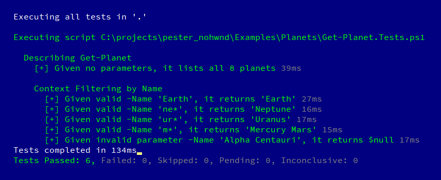

# Pester

Pester is the ubiquitous test and mock framework for PowerShell.

```powershell
# your function
function Get-Planet ([string]$Name='*')
{
  $planets = @(
    @{ Name = 'Mercury' }
    @{ Name = 'Venus'   }
    @{ Name = 'Earth'   }
    @{ Name = 'Mars'    }
    @{ Name = 'Jupiter' }
    @{ Name = 'Saturn'  }
    @{ Name = 'Uranus'  }
    @{ Name = 'Neptune' }
  ) | foreach { [PSCustomObject]$_ }

  $planets | where { $_.Name -like $Name }
}

# Pester tests
Describe 'Get-Planet' {
  It "Given no parameters, it lists all 8 planets" {
    $allPlanets = Get-Planet
    $allPlanets.Count | Should -Be 8
  }

  Context "Filtering by Name" {
    It "Given valid -Name '<Filter>', it returns '<Expected>'" -TestCases @(
      @{ Filter = 'Earth'; Expected = 'Earth' }
      @{ Filter = 'ne*'  ; Expected = 'Neptune' }
      @{ Filter = 'ur*'  ; Expected = 'Uranus' }
      @{ Filter = 'm*'   ; Expected = 'Mercury', 'Mars' }
    ) {
      param ($Filter, $Expected)

      $planets = Get-Planet -Name $Filter
      $planets.Name | Should -Be $Expected
    }

    It "Given invalid parameter -Name 'Alpha Centauri', it returns `$null" {
      $planets = Get-Planet -Name 'Alpha Centauri'
      $planets | Should -Be $null
    }
  }
}
```

This code example lies a tiny bit, [find it annotated and production ready here](Examples/Planets).

Learn more about the [usage and syntax](https://github.com/Pester/Pester/wiki) on our wiki.

## Installation

Pester is compatible with Windows PowerShell 2.x - 5.x on Windows 10, 8, 7, Vista and even 2003.
Since version 4.0.9 Pester is compatible also with PowerShell Core 6.x on Windows, Linux, macOS but with some [limitations](https://github.com/pester/Pester/wiki/Pester-on-PSCore-limitations).

Pester comes pre-installed with Windows 10, but we recommend updating, by running this PowerShell command _as administrator_:

```powershell
Install-Module -Name Pester -Force -SkipPublisherCheck
```

Not running Windows 10 or facing problems? See the [full installation and update guide](https://github.com/pester/Pester/wiki/Installation-and-Update).

## Features

### Test runner

Pester runs your tests and prints a nicely formatted output to the screen.



Command line output is not the only output option, Pester also integrates with Visual Studio Code, Visual Studio, and any tool that can consume nUnit XML output.

### Assertions

Pester comes with a suite of assertions that cover a lot of common use cases. Pester assertions range from very versatile, like `Should -Be`, to specialized like `Should -Exists`. Here is how you ensure that a file exists:

```powershell
Describe 'Notepad' {
    It 'Exists in Windows folder' {
        'C:\Windows\notepad.exe' | Should -Exist
    }
}
```

Learn more about assertion on [our wiki](https://github.com/pester/Pester/wiki/Should).

### Mocking

Pester has mocking built-in. Using mocks you can easily replace functions with empty implementation to avoid changing the real environment.

```powershell
function Remove-Cache {
    Remove-Item "$env:TEMP\cache.txt"
}

Describe 'Remove-Cache' {
    It 'Removes cached results from temp\cache.text' {
        Mock -CommandName Remove-Item -MockWith {}

        Remove-Cache

        Assert-MockCalled -CommandName Remove-Item -Times 1 -Exactly
    }
}
```

Learn more [about Mocking here](https://github.com/pester/Pester/wiki/Mock).

### Code coverage

Pester can measure how much of your code is covered by tests and export it to JaCoCo format that is easily understood by build servers.


Learn more about [code coverage here](https://github.com/pester/Pester/wiki/Code-Coverage).

### Build server integration

Pester integrates nicely with TFS, AppVeyor, TeamCity, Jenkins and other CI servers.

Testing your scripts, and all pull requests on AppVeyor is extremely simple. Just commit this `appveyor.yml` file to your repository, and select your repository on the AppVeyor website:

```yml
version: 1.0.{build}
image:
- Visual Studio 2017
- Ubuntu
install:
- ps: Install-Module Pester -Force -SkipPublisherCheck -Scope CurrentUser
build: off
test_script:
- ps: Invoke-Pester -EnableExit
```

See it [in action here!](https://ci.appveyor.com/project/nohwnd/planets)
In case you do not need to test your scripts against PowerShell Core, just simply remove entire line mentioning Ubuntu.

Pester itself is build on the community build server and Travis CI, and distributed mainly via PowerShell gallery.


 [](https://build.powershell.org/project.html?projectId=Pester)
 [](https://travis-ci.org/pester/Pester)
[](https://www.powershellgallery.com/packages/Pester)
[](https://www.powershellgallery.com/packages/Pester)


## Further reading

Do you like what you see? Learn how to use Pester with our [wiki guide](https://github.com/Pester/Pester/wiki), and continue with some of the other [resources](https://github.com/pester/Pester/wiki/Articles-and-other-resources).

## Got questions?

Got questions or you just want to get in touch? Use our issues page or one of these channels:

[](https://twitter.com/PSPester)
[](https://stackoverflow.com/questions/tagged/pester)
[](https://powershell.slack.com/messages/C03QKTUCS)
[](https://gitter.im/pester/Pester?utm_source=badge&utm_medium=badge&utm_campaign=pr-badge&utm_content=badge)
[](https://powershell.org/forums/forum/pester/)
